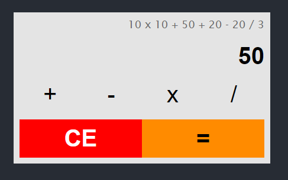

# Calculator Simple Documentation

## Description

This repository contains a simple calculator.

### Folder structure

Here's a folder structure for a Pandoc document:

```
index.html          # Main Files HTML
styles.css          # Style website
calculator.js       # Main Javascripts File
backup.html         # just for fun :)
|- images/          # Images folder.
```

